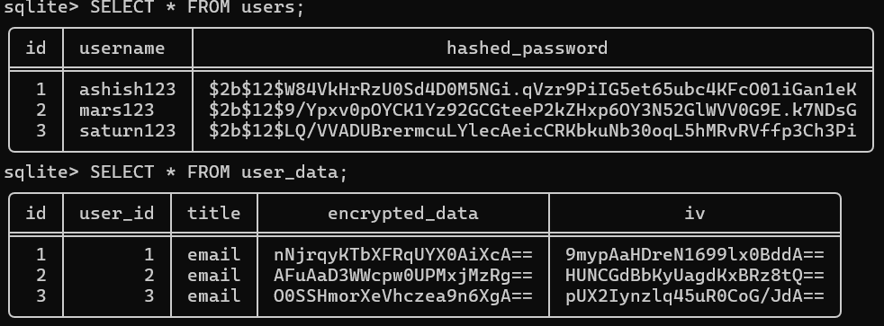

# 🔐 Cipher Safe — Encrypted Password Vault (Python + SQLite + AES)

<div align="center">


[](https://opensource.org/licenses/Apache-2.0)

A CLI-based secure password vault system built using Python that demonstrates real-world authentication, encryption, and secure data storage concepts.

</div>

---

# 🚀 Overview

Cipher Safe is a simple password manager where users can:
- Register securely
- Login with hashed passwords
- Store secrets securely
- Encrypt data using AES
- Decrypt data only after authentication

---

# Screenshot
<p align="center">

</p>

---
# ⚙️ How It Works

## 1️⃣ Registration
- Username + password input
- Password hashed using bcrypt
- Stored in SQLite database

---

## 2️⃣ Login
- Username verified from DB
- bcrypt checks password
- If correct → access granted

---

## 3️⃣ Vault System

### ➕ Add Data
- User enters title + secret
- Secret encrypted using AES (CBC mode)
- Encrypted data + IV(Initializer Vector) stored in DB

---

### 🔓 View Data
- Encrypted data fetched
- AES decryption performed
- Original secret displayed

---

# 🔐 Security Used

- bcrypt password hashing
- AES encryption (CBC mode)
- Random IV(Initializer Vector) per encryption
- Base64 encoding for DB storage
- SQLite structured storage

---

---

# 🧰 Tools & Libraries

- Python 3.x  
- sqlite3  
- bcrypt  
- pycryptodome (AES)  
- base64  

---

# 📦 Installation

```bash
git clone https://github.com/ashish-modak-22/Cipher_safe.git
```
---

```bash
cd cipher-safe
pip install bcrypt pycryptodome
python app.py
```
---

📁 Project Structure

```bash
Cipher_Safe/
│
├── app.py
├── database.db
└── README.md
```
---

💡Concepts Learned
- Authentication flow (register/login system)
- Password hashing using bcrypt
- Symmetric encryption using AES
- CBC mode encryption logic
- IV (Initialization Vector) usage
- Base64 encoding/decoding for storage
- SQLite database CRUD operations
- Secure backend system design
- Real-world vault system architecture

---

⚠️ Limitations
- CLI based system
- Single global encryption key
- No GUI interface
- No cloud storage
- No password recovery system

---

🚀 Future Improvements
- GUI using Tkinter
- Web app using Flask
- Per-user encryption keys
- Password strength checker
- Cloud database integration

---

📌 Summary

- Cipher Safe is a mini secure vault system that demonstrates:

- How real apps authenticate users
- How passwords are securely stored
- How encryption protects sensitive data
- How secure systems manage user data flow

---
